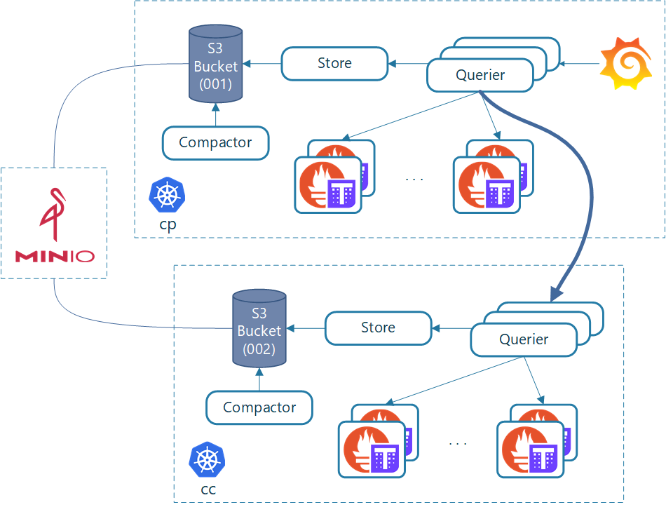

Deploy a full-fledged Thanos-based setup build on top of Prometheus-Operator locally on k3s and Minio.

Features:
* k3s-based lightweight Kubernetes (https://github.com/rancher/k3s) spinning up two clusters with each two nodes
* S3 storage via Minio (https://github.com/minio/minio) offering unlimited retention while Prometheus retention is minimal
* Thanos global view across the clusters: Control-plane (`cp`) has access to the metrics of the customer-cluster (`cc`)
* Grafana connected to Thanos Query within `cp`
* automated via bash scripts (using `docker-compose`, `docker`, `helm`, `kubectl`)
* manifests for all Thanos component (except `Ruler`)

This work is meant for testing only, in order to understand each component, and not at all production-ready.

# Architecture



Note that the current setup only deploys one Prometheus per cluster, but the architecture diagram pictures multiple ones. I wanted to show that Thanos can also deal with that kind of setup, having multiple Prometheis running in parallel but also as a HA setup using Thanos deduplication features.

# Requirements
Make sure you have `docker`, `docker-compose`, `kubectl` and `helm` installed and set up in your `PATH`.

# Setup
1. Set up Kubernetes clusters and Minio Server locally: Within `local-setup/` run `./startup.sh`.
2. Deploy and setup the Prometheus-Thanos setup: Run `./setup-all`.

# Work with it
You can use `kubectl` and `helm` as follows (e.g. for `cc` cluster:):
```
kubectl --kubeconfig=local-setup/kubeconfig-cc.yaml get pods --all-namespaces
helm --kubeconfig=local-setup/kubeconfig-cc.yaml --home=local-setup/.helm-cc list
```

The setup exposes the following UIs to the host, which you can access in your browser:
* Prometheus cp: `http://localhost:21090`
* Prometheus cc: `http://localhost:22090`
* Thanos cp: `http://localhost:21190`
* Thanos cc: `http://localhost:22190`
* Grafana cp: `http://localhost:21300` (username: `admin`, password: `admin123`)
* S3 (Minio): `http://localhost:19000` (username: `admin`, password: `admin123`)

For example, open Grafana `http://localhost:21300` and go to the Explore window, select the `Thanos` datasource and browse happily across both your clusters' metrics with unlimited retention utilizing S3 storage.

Note that Grafana Dashboards for Thanos components are not yet automatically deployed. Feel free to import them in Grafana (see `dashboards/`).

# Cleanup (full)
Within `local-setup/` simply run `./cleanup.sh`.
